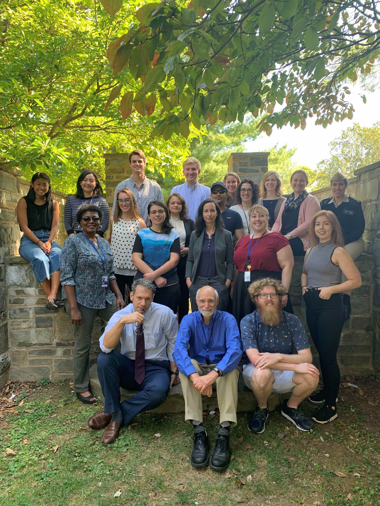
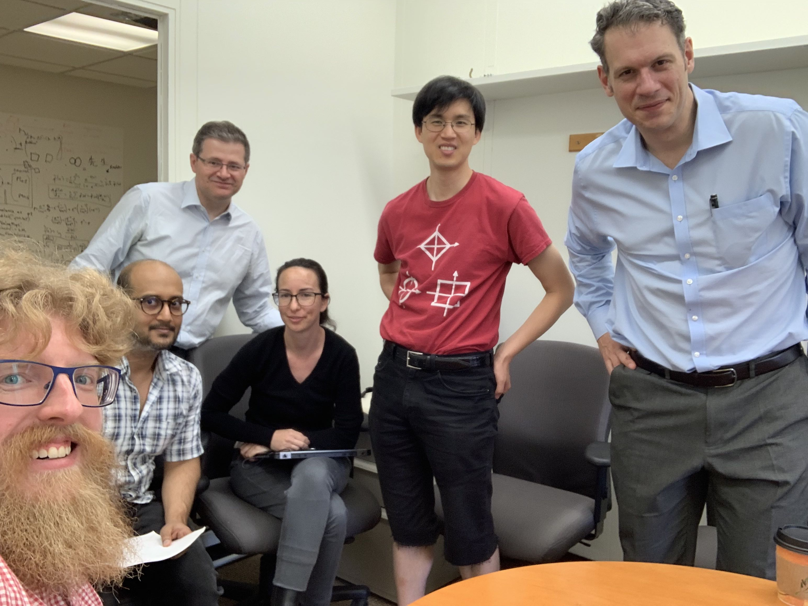

# Hiring: Postdoctoral Fellow

The [National Institute of Mental Health (NIMH)](http://www.nimh.nih.gov) is the largest funder of research on mental disorders in the world, with a current budget of over $1.6B per year. Our mission is to transform the understanding and treatment of mental illnesses through basic and clinical research, paving the way for prevention, recovery, and cure. The postdoctoral community at the NIH is large (approximately 4,000) strong and vibrant. Trainees come from across the U.S. and around the world. [Salary](https://www.training.nih.gov/postdoctoral_irta_stipend_ranges) for this position is defined by type of training and years of experience. [Benefits](https://www.training.nih.gov/programs/postdoc_irp) include health insurance for the trainee and his/her family, and support for coursework related to the trainee’s research and travel to meetings is often available.

At the NIMH’s Mood, Brain, and Development Unit, our central focus is understanding mood and its disorders, particularly in adolescents. We are interested in the relationship between reward processing, mood, and depression \(you can find our current thoughts [here](https://www.biorxiv.org/content/10.1101/2020.03.04.975136v1)\), as well as understanding the effects of mood states. We approach these questions with a broad range of techniques, benefitting from the unique scientific environment and resources that the NIH offers, as well as our collaborations around the world. In particular, we use longitudinal imaging protocols in fMRI and MEG at three different time scales, generative bayesian modeling, rapid development and deployment of tasks and measures via Pavlovia and Mechanical Turk. Additionally, we’ve developed a closed-loop, parametric, mood-manipulation task that produces strong changes in mood both in fMRI and over the internet (https://www.biorxiv.org/content/10.1101/815944v1). We are a team that works closely together, has many regular science and social meetings and collaborates extensively with others in and out of NIH.

	  

	<em>The people of the Mood, Brain, and Development Unit.</em>

We have a particularly close collaboration with the [NIMH Machine Learning Team](https://cmn.nimh.nih.gov/mlt) and there are opportunities for co-mentorship on projects with a computational focus.

	  
	
	<em>Collaboration with the Machine Learning Team</em>

## Qualifications:
We have multiple positions to fill and are looking for candidates with strengths in at least one of the following areas:
* Generative models of cognition
* Longitudinal neuroimaging studies of development
* Mood and mood disorders

All candidates should have programming skills in R, Python, or Matlab. Experience with open-science practices, code and data sharing, and open-source tools. Cognitive neuroscientists, engineers and other candidates with strong numerical and computational skills are particularly encouraged to apply.

# How to apply…

Email your resume, a short cover letter, and optionally, a link to your github repository and/or google scholar profile to:

Argyris.Stringaris@nih.gov

The National Institutes of Health is an equal opportunity employer. This position will be based at NIMH in Bethesda, MD.

	

